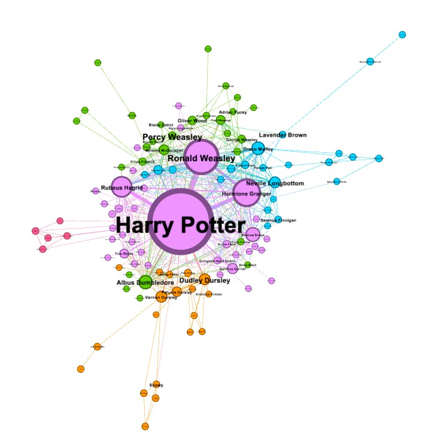

# Harry Potter Character Interaction Network



## Overview

The Harry Potter Character Interaction Network is a project that aims to analyze character interactions within the Harry Potter novels. It involves several key steps:

1. **Data Collection**: Characters and their references in the Harry Potter novels are scraped from the Harry Potter Wiki, which provides information about the chapters where characters are first referenced.

2. **Entity Dictionary**: This project creates an entity dictionary by compiling a list of all characters and their aliases in the books. This dictionary is crucial for character recognition.

3. **Coreference Resolution**: FastCoref is used to perform coreference resolution on the text. This step helps identify when different words or phrases in the text refer to the same character.

4. **Entity Matching**: Spacy's Entity matching is employed to extract all occurrences of character entities in the Harry Potter novels.

5. **Character Interaction Network**: The final goal is to construct a network of character interactions. An interaction is considered to occur when two characters appear in the book within N words of each other.

Inspired by projects like "Network of Thrones," this project enables you to explore the relationships and interactions between characters in the Harry Potter series.

## Features

- **Data Scraping**: Automated data collection from the Harry Potter Wiki to gather character references.

- **Entity Resolution**: Identification of character entities in the text through coreference resolution and entity matching.

- **Network Visualization**: Create a network graph of character interactions to visualize relationships within the novels.

- **Customization**: Adjust parameters to control the proximity for character interactions.

## Getting Started

To get started with this project, follow these steps:

1. **Clone the Repository**: Clone this repository to your local machine.

2. **Install Dependencies**: Ensure you have the required Python libraries installed. You can typically use `pip` for this purpose.

3. **Run the Project**: Execute the provided scripts to start data collection, coreference resolution, and network construction.

4. **Customize**: Adjust the parameters to suit your analysis needs, such as changing the proximity threshold for character interactions.

## Usage

Provide a detailed guide on how to use your project. Include code examples and explanations for various use cases.

<!-- ```bash
$ python data_collection.py
$ python coreference_resolution.py
$ python network_construction.py
``` -->